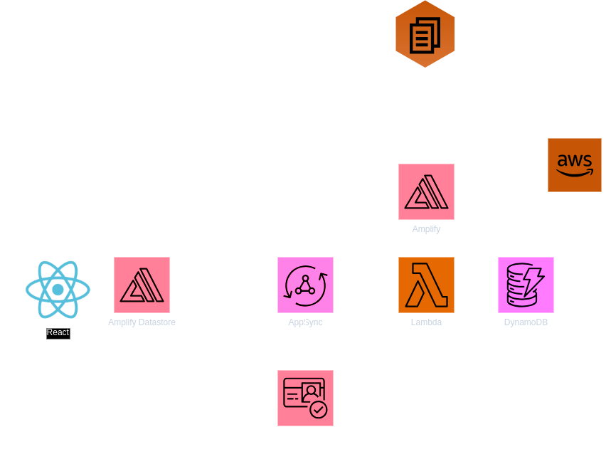

# Architecture

## Composants déployés
- [X] [API Gateway](https://docs.aws.amazon.com/apigateway/) : interface fournissant une API pour tout le backend
- [X] [Lambda](https://docs.aws.amazon.com/lambda/) : Backend, tourne sur Python 3.13
- [X] [DynamoDB](https://docs.aws.amazon.com/dynamodb/) : Base de données NoSQL
- [X] [AWS Amplify](https://docs.aws.amazon.com/amplify/) : build et sert le frontend de manière statique, à partir de Github
- [X] [React](https://react.dev/) : Framework frontend (Javascript) utilisé pour le frontend
- [X] [AWS Cognito](https://docs.aws.amazon.com/cognito/) : authentification et autorisation des utilisateurs
- [ ] AWS Amplify Datastore pour fonctionnalités hors-ligne
- [ ] AppSync : permet de déverouiller des fonctionnalités hors-ligne mais aussi de créer un niveau d'abstraction du backend pour l'application en utilisant GraphQL
- [ ] Github Actions : CI/CD pour le déploiement et les tests de l'application

## Diagramme

## Frontend
L'objectif est de créer une Progressive Web App (PWA), qui permette le portage sur n'importe quelle plateforme fournissant des fonctionnalités proche d'une application native mais à partir du navigateur. Cette PWA offre la capacité de fonctionnalité __Offline First__.

Le Frontend tourne sur React, est servit à partir d'Amplify. AppSync et Amplify Datastore permettront de couvrir les fonctionnalités hors-ligne.

## Backend
Le backend offre en premier une API qui redirige la majorité des requêtes sur Lambda, une Function-as-a-Service (FaaS). Ainsi, aucun besoin de faire tourner un serveur inutilement, la fonction appelée par l'API s'activera uniquement le temps de calculer la réponse, puis redeviendra idle.

L'API Gateway est une API REST fonctionnant comme proxy, ce qui nous offre plus de flexibilité en terme de cache et de validation des requêtes.